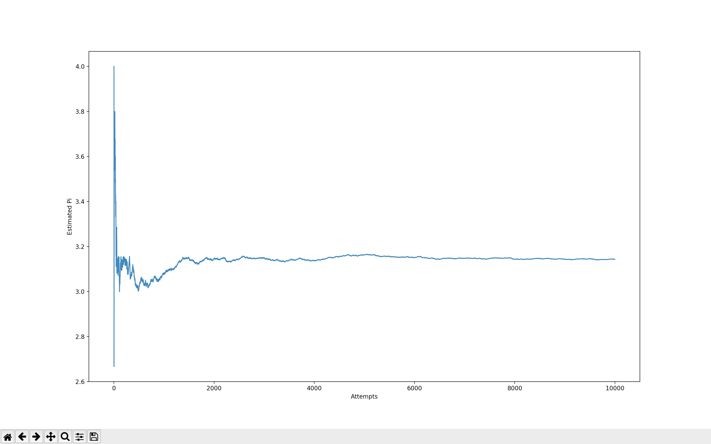
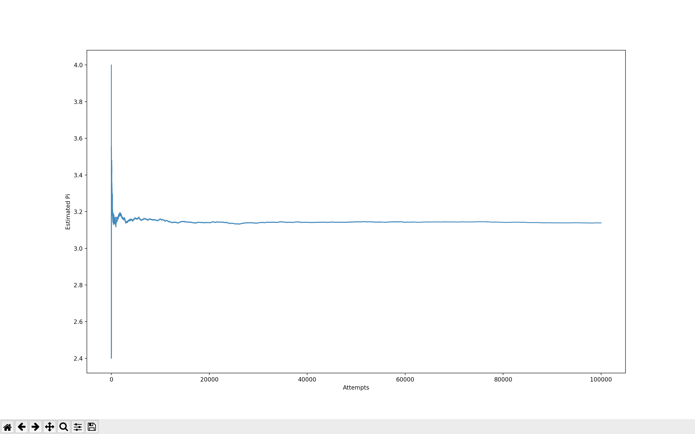
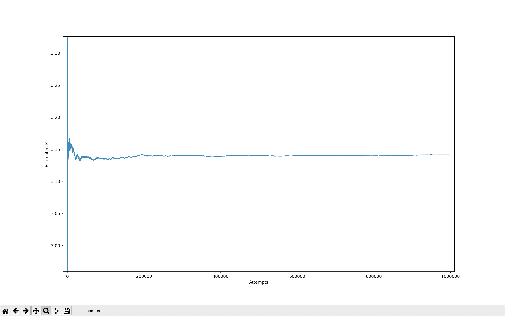

# Monte Carlo Simulation for Pi
#### Contains the following: ####
  ### 1. A serial approach to the estimation of Pi using the Monte Carlo Method (C++)
  
  
  
  
  ### 2. A Multithreaded estimation of Pi based on the Monte Carlo Method (C++)
  
  
  ### 3. Using matplotlib, plots the estimated value of Pi using Monte Carlo Method (Python)
  10000 Iterations
  
  
  100000 Iterations
  
  
  10000 Iterations Zoomed
  
  
  
  ### 4. A parallel computing version that estimates Pi using the Monte Carlo Method in OpenMP (C)
  
  
  
  #### To use OpenMP

> /usr/local/opt/llvm/bin/clang -fopenmp -L/usr/local/opt/llvm/lib main.c -o a

> ./a

  
  
  ### 5. A parallel computing version that estimates Pi using the Monte Carlo Method in MPI (C)
  
  MPI
  
  
  
  MPI Reduction
  
  
  
  MPI Send & Receive
  
  

#### To use MPI

The best performance is achieved when the number of nodes is equal to number of cores. E.g.:

> $HOME/opt/usr/local/bin/mpicc -o pi ./mpi_pi.c

> $HOME/opt/usr/local/bin/mpirun -np 4 ./pi

